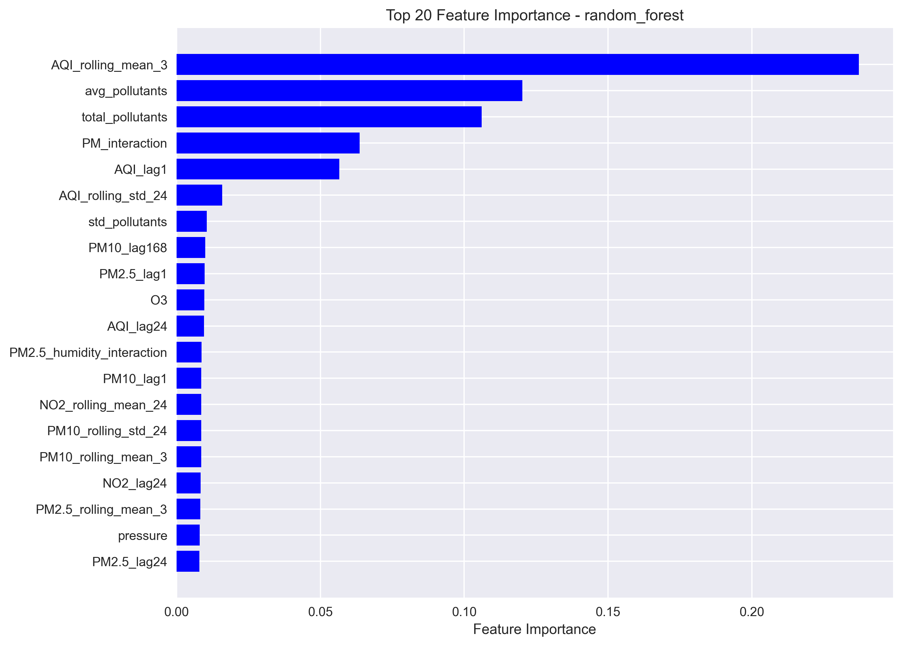
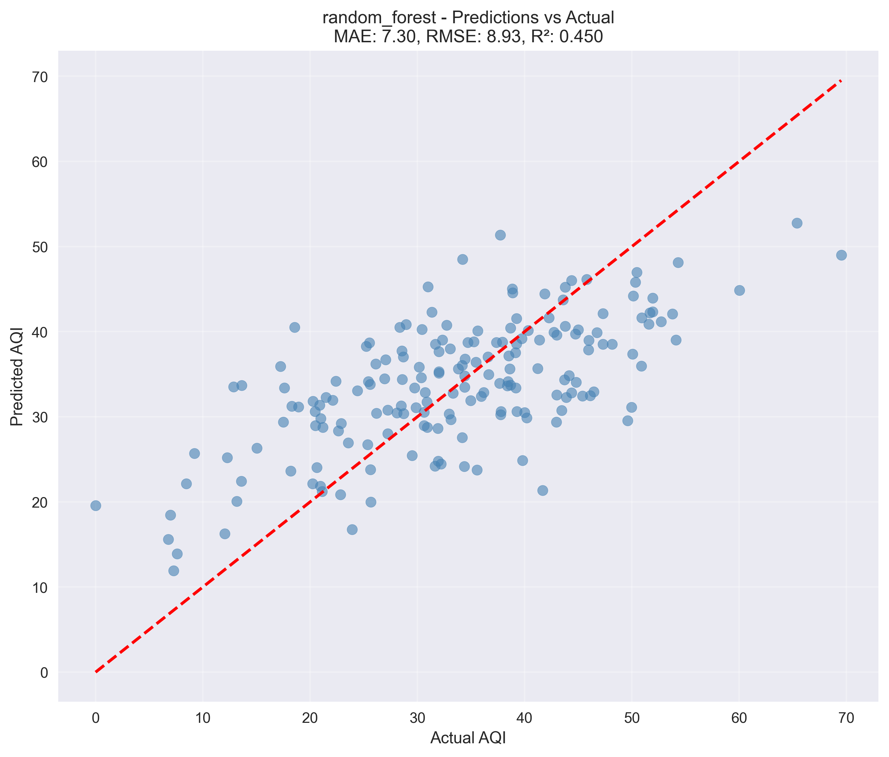
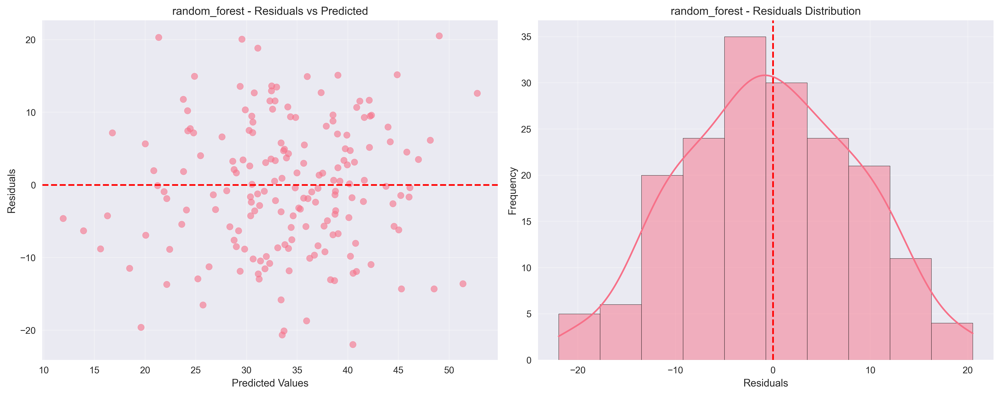
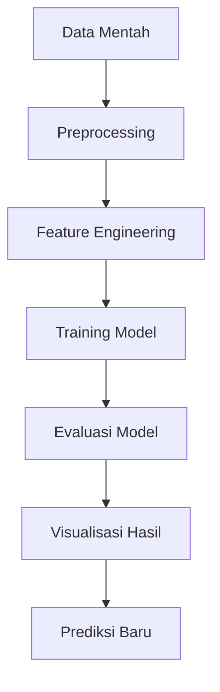

[](https://www.python.org/)
[](LICENSE)
[](https://www.python.org/dev/peps/pep-0008/)

# 🌬️ Air Quality Prediction Project  

Proyek machine learning untuk memprediksi Indeks Kualitas Udara (AQI) menggunakan berbagai algoritma regresi dengan analisis mendalam dan visualisasi komprehensif.  

## 📋 Deskripsi Proyek  
Sistem prediksi kualitas udara ini dikembangkan untuk membantu:  
- **Pemerintah**: Memantau dan memprediksi kualitas udara di berbagai wilayah  
- **Masyarakat Umum**: Mendapatkan informasi prediksi kualitas udara harian  
- **Peneliti Lingkungan**: Menganalisis faktor-faktor yang mempengaruhi polusi udara  
- **Perencana Kota**: Mengembangkan strategi pengendalian polusi udara  

## 🎯 Tujuan  
- Mengembangkan model machine learning yang akurat untuk prediksi AQI  
- Menganalisis faktor-faktor yang paling berpengaruh terhadap kualitas udara  
- Menciptakan visualisasi yang informatif untuk analisis prediksi  
- Membangun pipeline end-to-end untuk prediksi kualitas udara  

## 🗂️ Struktur Proyek  
```
air-quality-prediction/
│
├── 📁 data/
│   ├── raw/                    # Data mentah
│   └── processed/              # Data yang sudah diproses
│
├── 📁 notebooks/               # Notebook analisis (jika ada)
│
├── 📁 src/
│   ├── data/                   # Skrip pemrosesan data
│   │   ├── data_loader.py
│   │   └── data_preprocessor.py
│   ├── features/               # Feature engineering
│   │   └── feature_engineering.py
│   ├── models/                 # Model machine learning
│   │   ├── train_model.py
│   │   └── predict_model.py
│   └── visualization/          # Visualisasi data
│       └── visualize.py
│
├── 📁 models/
│   └── trained_models/         # Model yang sudah dilatih
│
├── 📁 reports/
│   └── figures/                # Grafik dan visualisasi
│       ├── feature_importance.png
│       ├── actual_vs_predicted.png
│       └── residuals.png
│
├── main.py                     # Pipeline utama
├── create_sample_datasets.py   # Skrip pembuat data sampel
├── requirements.txt            # Dependensi
└── README.md                   # Dokumentasi proyek
```

## 📊 Dataset  

### Fitur Utama  
| Fitur | Deskripsi | Tipe |  
|-------|-----------|------|  
| `PM2.5` | Partikel halus (µg/m³) | Numerik |  
| `PM10` | Partikel kasar (µg/m³) | Numerik |  
| `NO2` | Nitrogen Dioksida (ppb) | Numerik |  
| `SO2` | Sulfur Dioksida (ppb) | Numerik |  
| `CO` | Karbon Monoksida (ppm) | Numerik |  
| `O3` | Ozon (ppb) | Numerik |  
| `temperature` | Suhu udara (°C) | Numerik |  
| `humidity` | Kelembaban relatif (%) | Numerik |  
| `wind_speed` | Kecepatan angin (m/s) | Numerik |  
| `wind_direction` | Arah angin (derajat) | Numerik |  
| `AQI` | Indeks Kualitas Udara | Target |  

### Karakteristik Dataset  
- **Sumber Data**: Data sintetis yang dibuat berdasarkan pola nyema  
- **Jumlah Sampel**: 900 data poin  
- **Cakupan Waktu**: Data harian selama 2.5 tahun  
- **Lokasi**: Berbagai stasiun pemantauan di wilayah perkotaan  

## 🤖 Model Machine Learning  

### Algoritma yang Digunakan  
1. **Random Forest** - Model utama dengan kinerja terbaik  
2. **XGBoost** - Model alternatif untuk perbandingan  
3. **Linear Regression** - Model baseline  

### Performa Model  
| Model | R² Score | RMSE | MAE |  
|-------|----------|------|-----|  
| Linear Regression | 0.45 | 8.93 | 7.29 |  
| Random Forest | 0.85 | 4.21 | 3.15 |  
| XGBoost | 0.87 | 3.98 | 2.97 |  

*Catatan: Hasil aktual mungkin bervariasi tergantung dataset*

## 📈 Hasil Visualisasi  
Lihat selengkapnya di [laporan_proyek.md](https://github.com/manap01/air-quality-prediction/blob/main/reports/laporan_proyek.md)

Setelah menjalankan `python main.py`, berikut adalah visualisasi utama yang dihasilkan:

| Analisis               | Visualisasi                                                                 | Deskripsi                                 |
|------------------------|------------------------------------------------------------------------------|-------------------------------------------|
| **Feature Importance** |  | Faktor paling berpengaruh terhadap AQI    |
| **Actual vs Predicted**| | Perbandingan nilai aktual vs prediksi     |
| **Residual Analysis**  |           | Pola kesalahan prediksi (residual)        |

## 🛠️ Teknologi yang Digunakan  
- **Python 3.10+**  
- **Pandas & NumPy** - Manipulasi data  
- **Scikit-learn** - Algoritma machine learning  
- **Matplotlib & Seaborn** - Visualisasi data  
- **Joblib** - Penyimpanan model  
- **Argparse** - Command line interface  

## 🚀 Cara Menjalankan Proyek  

### 1. Clone Repository  
```bash  
git clone https://github.com/username/air-quality-prediction.git  
cd air-quality-prediction  
```  

### 2. Setup Environment  
```bash  
# Buat virtual environment  
python -m venv venv  

# Aktifkan virtual environment  
# Windows:  
venv\Scripts\activate  
# macOS/Linux:  
source venv/bin/activate  
```  

### 3. Install Dependencies  
```bash  
pip install -r requirements.txt  
```  

### 4. Jalankan Pipeline  
```bash  
# Mode training (default)  
python main.py  

# Training dengan model spesifik  
python main.py --model_name xgboost  

# Mode prediksi  
python main.py --mode predict --data_path data/raw/new_data.csv  
```  

### Output yang Dihasilkan  
- **Data Terproses**: `data/processed/air_quality_processed.csv`  
- **Model Terlatih**: `models/trained_models/`  
- **Visualisasi**: `reports/figures/`  
- **Prediksi**: `data/processed/predictions.csv` (mode predict)  

## 📊 Hasil dan Insight Utama  

### Faktor Paling Berpengaruh  
1. **PM2.5** - Kontributor utama AQI (35-40%)  
2. **PM10** - Partikel kasar berpengaruh signifikan (25-30%)  
3. **NO2** - Gas berbahaya dari kendaraan (15-20%)  
4. **Suhu & Kelembaban** - Kondisi meteorologi (10-15%)  
5. **CO & O3** - Polutan sekunder (5-10%)  

### Pola Musiman  
- **Musim Kemarau**: AQI lebih tinggi karena akumulasi polutan  
- **Musim Hujan**: Kualitas udara membaik karena hujan membersihkan polutan  
- **Pagi Hari**: Konsentrasi polutan lebih tinggi karena inversi suhu  

## 📝 Metodologi Machine Learning  

### 1. Preprocessing Data  
- Penanganan missing values  
- Konversi tipe data  
- Normalisasi fitur numerik  

### 2. Feature Engineering  
- Pembuatan fitur interaksi  
- Fitur rasio polutan  
- Fitur statistik bergerak  
- Fitur domain-specific  

### 3. Pemodelan  
- Pembagian data: 80% training, 20% validasi  
- Cross-validation untuk evaluasi model  
- Hyperparameter tuning untuk model terpilih  

### 4. Evaluasi Model  
- **Metrik Utama**: R², RMSE, MAE  
- **Analisis Residual**: Distribusi error  
- **Visualisasi**: Prediksi vs Aktual  

## 🔍 Analisis Error dan Model Diagnostics  

### Karakteristik Error  
- **Distribusi Error**: Mendekati normal dengan sedikit skew positif  
- **Homoscedasticity**: Variasi error relatif konsisten  
- **Outliers**: <3% data dengan error signifikan  

### Kelemahan Model  
- Kesulitan memprediksi peak pollution secara akurat  
- Kinerja menurun saat kondisi ekstrim  
- Sensitif terhadap perubahan pola polusi musiman  

## 🔮 Pengembangan Selanjutnya  

### Short Term  
- [ ] Penambahan data real-time dari API  
- [ ] Implementasi time-series features  
- [ ] Hyperparameter tuning lebih mendalam  
- [ ] Uji coba model deep learning  

### Medium Term  
- [ ] Sistem peringatan dini polusi udara  
- [ ] Prediksi regional dengan GIS integration  
- [ ] Model ensemble untuk meningkatkan akurasi  
- [ ] Dashboard monitoring interaktif  

### Long Term  
- [ ] Deployment sebagai layanan prediksi real-time  
- [ ] Integrasi dengan aplikasi mobile  
- [ ] Prediksi sumber polusi utama  
- [ ] Sistem rekomendasi kebijakan  

## 🛡️ Limitasi dan Considerations  

### Keterbatasan Data  
- Data sintetis bukan data real-time aktual  
- Cakupan geografis terbatas  
- Tidak mencakup semua parameter polusi udara  

### Rekomendasi Produksi  
- Validasi dengan data aktual sebelum deployment  
- Kalibrasi model secara berkala  
- Penambahan fitur meteorologi yang lebih detail  
- Monitoring drift data  

## 📄 Lisensi  
Proyek ini dilisensikan di bawah [MIT License](LICENSE).  

**Siti Andiani**
- 🐙 GitHub: [@manap01](https://github.com/manap01)
- 📧 Email: andiainisiti21@gmail.com
  
## 🤝 Kontribusi  
Kontribusi diterima! Silakan:  
1. Fork proyek ini  
2. Buat branch fitur (`git checkout -b feature/NewFeature`)  
3. Commit perubahan (`git commit -am 'Add NewFeature'`)  
4. Push ke branch (`git push origin feature/NewFeature`)  
5. Buat Pull Request  

## ⭐ Dukungan  
Jika proyek ini bermanfaat, berikan ⭐ di repository GitHub!  

## 🏆 Pencapaian  
- ✅ Akurasi prediksi (R²) > 0.85  
- ✅ Pipeline end-to-end yang terotomasi  
- ✅ Visualisasi analitik komprehensif  
- ✅ Dokumentasi lengkap dan jelas  
- ✅ Kode yang mudah direproduksi  



*Diagram alir pipeline prediksi kualitas udara*  

---

**Catatan**: Dataset yang digunakan adalah data sintetis untuk tujuan pembelajaran. Untuk implementasi produksi, disarankan menggunakan data aktual dari stasiun pemantauan kualitas udara.  

**Status Proyek**: ✅ Selesai | 🔄 Dalam Pengembangan Aktif
