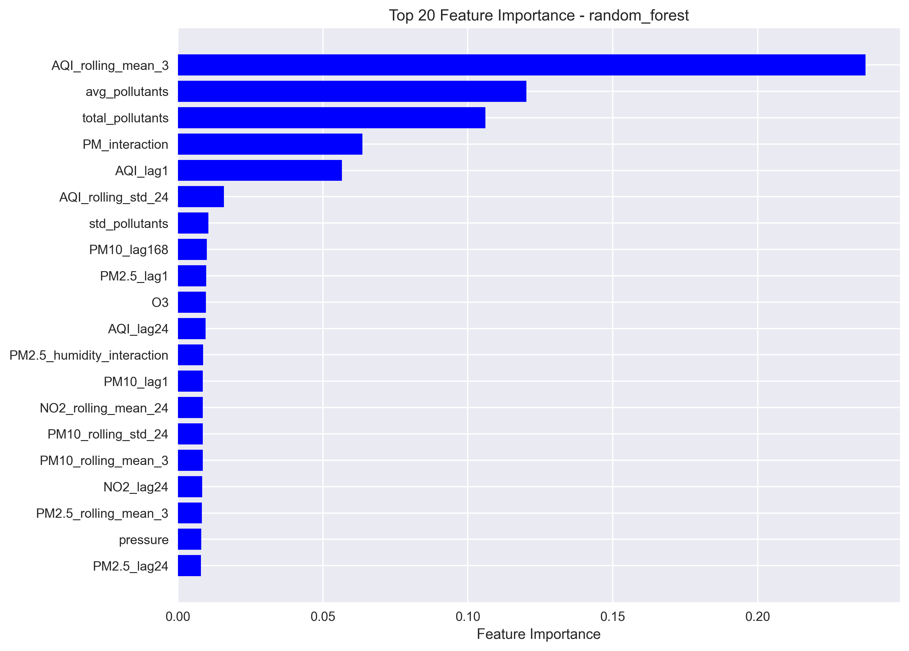

# Laporan Proyek Prediksi Kualitas Udara

## Hasil Evaluasi Model

**Model yang digunakan**: random_forest

**Metrik Evaluasi**:
- MAE (Mean Absolute Error): 7.2952
- RMSE (Root Mean Squared Error): 8.9337
- R² (R-Squared): 0.4503

## Visualisasi Kinerja Model

### 1. Actual vs Predicted

### 2. Feature Importance

### 3. Residual Analysis

## Interpretasi Hasil
Model random_forest menunjukkan kinerja sebagai berikut:
- **MAE**: Rata-rata kesalahan absolut prediksi adalah 7.30 poin AQI
- **RMSE**: Kesalahan prediksi standar adalah 8.93 poin AQI
- **R²**: Model menjelaskan 45.0% variasi dalam data
